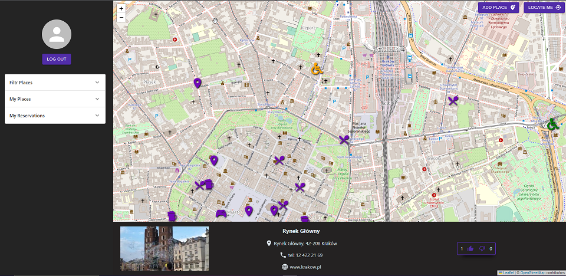
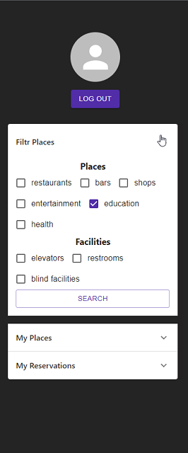

# Facilites Map

## Table of contents

- [About the Project](#about-the-project)
- [Technologies](#used-technologies)
- [Installation](#installation)

## About the Project

Aplication provides a map on which user can check, add and rate places comfortable to people with disabilities. Users can also make a reservation on facility.
Markers on the map indicate the type of place and accessibility rating. The application enables geolocation.

Navigation is adapted to the needs of people with limited mobility.

Users can filter places and facilities by type, see the list of reservations and added places.

### Used Technologies

- React
- TypeScript
- React Leaflet
- Material UI
- SASS

### Installation

_npm install_

### live version

To see live version of project check out: [www.react-disabiltymap.azurewebsites.net](https://react-disabiltymap.azurewebsites.net/)

Backend repo: https://github.com/wobrozek/disability-map-api
